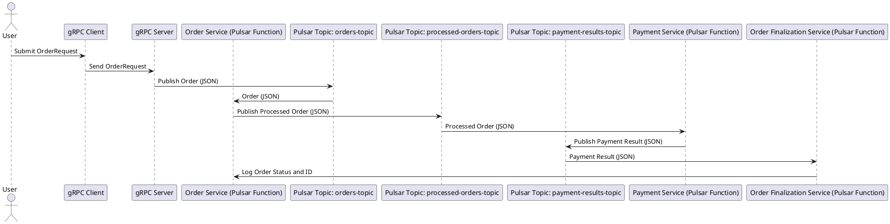

Below is a comprehensive and industry-standard README file for your project. This README includes sections that cover the project overview, setup instructions, usage, testing, and more.

---

# Order Processing and Payment System

This project implements an order processing and payment system using Apache Pulsar functions, gRPC, and Docker. The system is designed to handle high-concurrency order requests, process payments, and finalize orders, all in an asynchronous and scalable manner.

## Table of Contents

1. [Overview](#overview)
2. [Architecture](#architecture)
3. [Getting Started](#getting-started)
4. [Directory Structure](#directory-structure)
5. [Usage](#usage)
6. [Testing](#testing)
7. [Deployment](#deployment)
8. [Contributing](#contributing)
9. [License](#license)

## Overview

This system is composed of multiple services:
- **gRPC Server**: Receives order requests and forwards them to the order processing service.
- **Order Processing Service**: A Pulsar function that processes incoming orders.
- **Payment Service**: A Pulsar function that processes payment for the orders.
- **Order Finalization Service**: A Pulsar function that finalizes the order processing based on payment results.

The services communicate via Apache Pulsar topics, with data being transferred in JSON format between Pulsar functions.

## Architecture

The architecture of this system involves several components working together:

- **gRPC Client**: Submits order requests.
- **gRPC Server**: Forwards order requests to the order processing system.
- **Apache Pulsar**: Facilitates messaging between the services.
- **Pulsar Functions**: Handle core business logic for order processing, payment processing, and order finalization.

### Architecture Diagram



## Getting Started

### Prerequisites

- **Docker** and **Docker Compose** installed on your machine.
- **Go** (1.19 or higher) for local development and testing.
- **Pulsar CLI** for managing Pulsar functions.

### Setup

1. **Clone the repository**:
    ```sh
    git clone https://github.com/your-repo/order-payment-system.git
    cd order-payment-system
    ```

2. **Build the Docker images**:
    ```sh
    ./build.sh
    ```

3. **Start the services**:
    ```sh
    ./start.sh
    ```

4. **Deploy Pulsar functions**:
    ```sh
    ./deploy_pulsar_functions.sh
    ```

## Directory Structure

```plaintext
order-payment-system/
├── cmd/
│   ├── grpc_server/
│   │   └── main.go
├── internal/
│   ├── domain/
│   │   ├── models.go
│   ├── grpc/
│   │   ├── server.go
│   ├── pulsar/
│   │   ├── order_processing.go
│   │   ├── payment_processing.go
│   │   ├── order_finalization.go
│   ├── proto/
│   │   ├── order.proto
├── test/
│   ├── grpc/
│   │   ├── server_test.go
│   ├── pulsar/
│   │   ├── order_processing_test.go
│   │   ├── payment_processing_test.go
│   │   ├── order_finalization_test.go
├── Dockerfile
├── docker-compose.yml
├── start.sh
├── stop.sh
├── build.sh
├── deploy_pulsar_functions.sh
├── test.sh
└── README.md
```

## Usage

1. **Submit Orders**: Use a gRPC client to submit order requests to the gRPC server. The server listens on port `50051`.

2. **Monitor Services**: Check the logs and status of services using `docker-compose logs` and `docker-compose ps`.

3. **Scaling**: Adjust the number of replicas or resources allocated to the services by modifying the `docker-compose.yml` file.

## Testing

To run tests, use the provided test script:

```sh
./test.sh
```

This script runs unit tests for the gRPC server and Pulsar functions. Ensure that the environment is properly set up before running the tests.

## Deployment

1. **Build Docker Images**:
    ```sh
    ./build.sh
    ```

2. **Push to Docker Registry**: Use the `deploy.sh` script to push Docker images to your registry.

3. **Deploy**: Deploy the images to your target environment (e.g., Kubernetes, AWS ECS).

## Contributing

Contributions are welcome! Please follow the [contribution guidelines](CONTRIBUTING.md) and submit a pull request.

## License

This project is licensed under the MIT License - see the [LICENSE](LICENSE) file for details.
```

### Notes

- **Replace Placeholders**: Make sure to replace placeholders like `https://github.com/your-repo/order-payment-system.git` and any other references specific to your environment or project.
- **Custom Sections**: Add any other sections that might be relevant, such as acknowledgments, FAQ, or more detailed deployment instructions.
- **Updating**: Keep the README updated with any changes in the project structure or configuration to ensure clarity for future users and contributors.